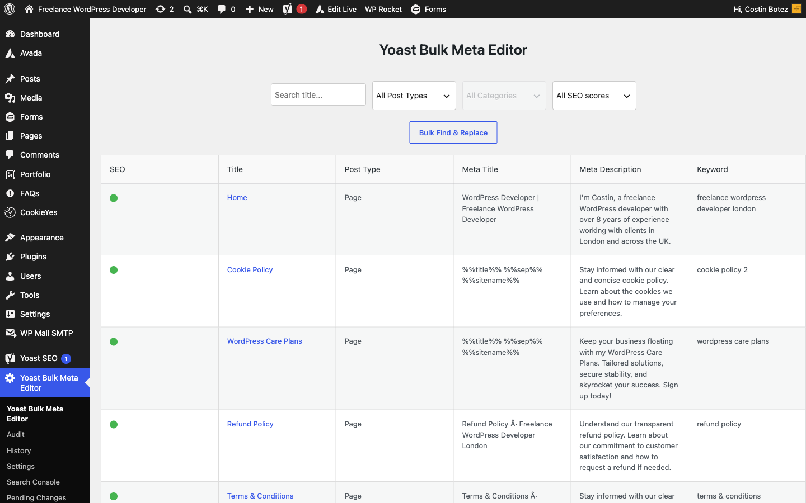
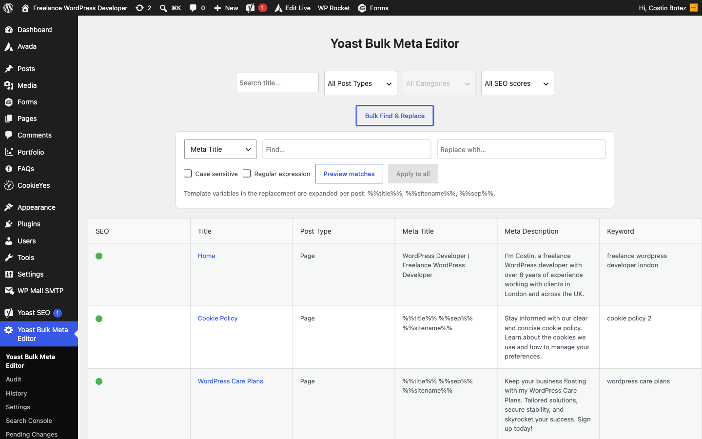
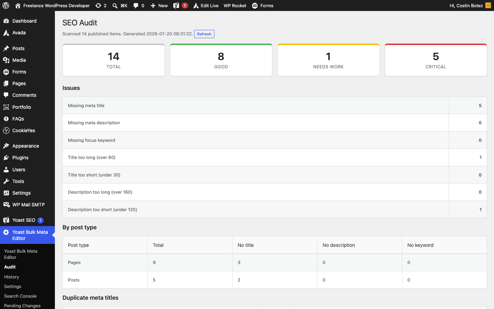
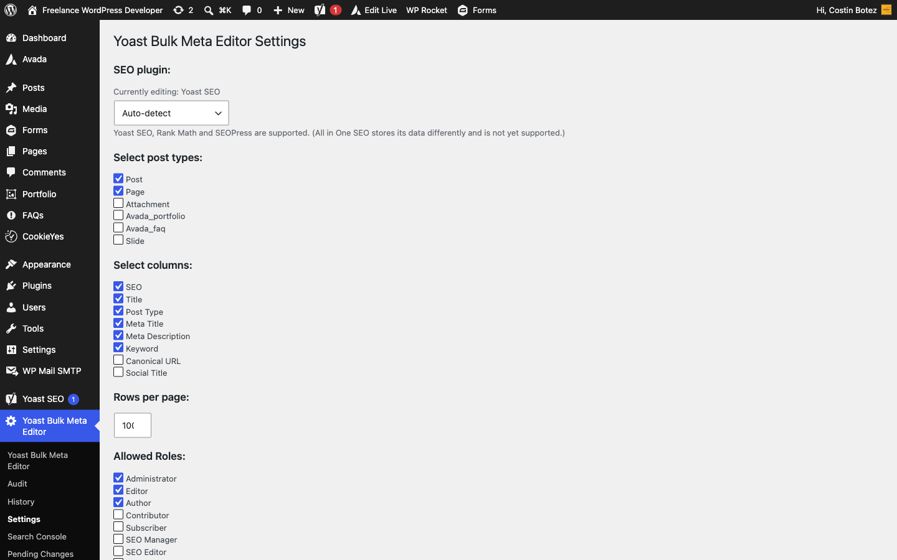

# Yoast SEO Bulk Meta Editor

**See every title and meta description at once. Rewrite them fast. Undo anything.**

A WordPress plugin for anyone who maintains SEO metadata across a whole site — it
puts the meta title, description and focus keyword for every post, page and public
custom post type into one sortable table, adds a live Google preview and per‑row SEO
scoring as you type, lets you find & replace across hundreds of posts at once, and
records every change so a bad edit is always one click from being reverted. Works with
**Yoast SEO, Rank Math and SEOPress**.


[Quick start](#-quick-start-under-5-minutes) · [Features](#what-the-plugin-includes) · [Screenshots](#screenshots) · [Roadmap](#roadmap) · [Development](#development)

Author: [Costin Botez](https://nomad-developer.co.uk/) · [Nomad Developer](https://nomad-developer.co.uk/) · [GitHub](https://github.com/costibotez)

## Why this plugin exists

Editing SEO metadata one post at a time is slow and error-prone. Opening every post in
the block editor just to fix a truncated title, spotting duplicate descriptions across a
site, or rolling out a brand rename across hundreds of snippets — none of that scales in
the default WordPress UI. This plugin turns all of it into a single spreadsheet-style
screen with a safety net, so you can move fast without writing metadata you can't take back.

## What the plugin includes

### 📝 Bulk inline editor
- Every post, page and public custom post type in one sortable table
- Edit meta title, description and focus keyword inline, saved via AJAX
- Character counters, an unsaved-changes guard, and dirty-cell highlighting
- Filter by search text, post type and category; **"Load More"** for large sites
- Configurable rows per page and selectable columns
- WPML-aware — filter by language with flag icons in the table

### 🔍 Live SERP preview & scoring
- **Live Google preview** in desktop or mobile layout, truncated like real results
- **Per‑row SEO health score** — a traffic-light dot flags missing or over/under-length fields
- **"Show only problems"** filter to jump straight to the rows that need work

### 🔁 Bulk find & replace
- Search and replace across meta titles, descriptions or keywords site-wide
- Preview affected rows before you apply anything
- Case sensitivity, **regular expressions**, and template variables (`%%title%%`, `%%sitename%%`, `%%sep%%`)

### 📊 Site-wide SEO audit
- A dashboard of your whole site: score distribution and per-post-type breakdown
- Missing / over-length / under-length titles and descriptions, missing keywords
- Cross-post **duplicate title & description** detection
- One-click jumps into the editor with the right filter pre-applied

### 📈 Google Search Console metrics
- Connect a property over OAuth and pull the last ~28 days of data
- Optional **Clicks / Impressions / CTR / Position** columns in the editor
- Prioritise rewriting metas on high-impression, low-CTR pages

### 🤖 AI meta generation
- Draft meta titles and descriptions from page content with **your own Claude or OpenAI key**
- Per-row **Generate** button, or **"AI: fill problem rows"** in bulk
- Always inserted as unsaved, highlighted edits — nothing is written until you approve it

### 🕓 Change history & approvals
- Every edit (single, undo, revert or bulk) is logged with old value, new value, user and time
- **One-click revert** of any logged change from the History page
- **Draft & scheduled changes** — submit edits for review; an admin approves, rejects or schedules them, and scheduled changes apply automatically

### 🔒 Secure by design
- Nonces and capability checks on every AJAX action
- Meta writes restricted to an allow-list of SEO keys, with per-post `edit_post` checks
- All values escaped on output and sanitized per field on save
- Uninstall cleanup removes options, the custom capability and history tables on delete

## ⚡ Quick start (under 5 minutes)

1. Upload `seo-bulk-meta-editor` to `wp-content/plugins/` and activate it (or install from the Plugins screen)
2. Make sure one supported SEO plugin is active — [Yoast SEO](https://wordpress.org/plugins/wordpress-seo/), [Rank Math](https://wordpress.org/plugins/seo-by-rank-math/) or [SEOPress](https://wordpress.org/plugins/wp-seopress/)
3. Open **Yoast Bulk Meta Editor** from the main admin menu
4. Click any cell to edit — the Google preview and SEO score update live — then **Save Changes**

> **Requirement:** one of Yoast SEO, Rank Math or SEOPress must be installed and active.
> All in One SEO is **not** supported — it stores data in a custom table rather than post meta.
> The active plugin is auto-detected (Yoast → Rank Math → SEOPress), or pick one explicitly in **Settings**.

## Admin pages

| Page | What it does |
|------|--------------|
| **Editor** | The bulk table with inline editing, live SERP preview, scoring and find & replace |
| **Audit** | Site-wide score distribution, issue breakdown and duplicate detection |
| **History** | Full change log with one-click revert |
| **Pending Changes** | Approve, reject, schedule or cancel submitted draft edits |
| **Search Console** | Connect a GSC property and refresh clicks/impressions/CTR/position |
| **AI Assistant** | Choose provider (Claude / OpenAI), enter your API key and optional model |
| **Settings** | Post types, columns, allowed roles, rows per page, active SEO provider, license key |

## Screenshots

| Bulk editor & live preview | Bulk find & replace |
|----------------------------|---------------------|
|  |  |

| SEO audit dashboard | Settings & SEO provider |
|---------------------|-------------------------|
|  |  |

## Roadmap

- `WP_List_Table` for the editor & history pages, with server-side search and pagination
- History retention policy and filters
- Batched find & replace and full class split into `includes/`
- Export-only CSV of metadata

## Development

WordPress 5.0+, PHP 7.2+. No build step. A `composer.json` provides
[PHP_CodeSniffer](https://github.com/squizlabs/PHP_CodeSniffer) with the WordPress Coding
Standards ruleset (`phpcs.xml.dist`), run in CI on every push (`.github/workflows/ci.yml`).

```
seo-bulk-meta-editor.php   Bootstrap, editor page, audit, history, settings + AJAX handlers
includes/
  gsc.php                  Google Search Console integration (OAuth, columns, cron)
  pending.php              Draft & scheduled changes + approval workflow
  ai.php                   AI meta generation (Claude / OpenAI)
css/style.css              Admin styles
js/
  bulk-meta-editor.js      Editor UI — inline edit, SERP preview, scoring, find & replace
  history.js               History page interactions
  jquery.tablesorter.min.js  Column sorting
languages/                 Translation files (text domain: seo-bulk-meta-editor)
uninstall.php              Removes options, capability and tables on delete
```

**Extension hooks** (used by the bundled modules and available to your own code):

| Hook | Type | Purpose |
|------|------|---------|
| `ybme_available_columns` | filter | Register additional read-only editor columns |
| `ybme_render_column_cell` | filter | Render a cell for a custom column (`$cell, $col, $post_id, $permalink`) |
| `ybme_editor_actions` | action | Add buttons to the editor toolbar |
| `ybme_editor_js_vars` | filter | Inject JS variables / i18n strings |
| `ybme_install_tables` | action | Create module tables on activation |

Lint locally with `composer install && composer lint` (`composer lint:fix` to auto-fix).

## Contributing

Pull requests and issues are welcome — submit improvements or report problems on
[GitHub](https://github.com/costibotez).

## License

GPL-2.0-or-later.

---

Built by [Costin Botez](https://nomad-developer.co.uk/) — Nomad Developer · [Buy me a coffee](https://www.buymeacoffee.com/costinbotez)
